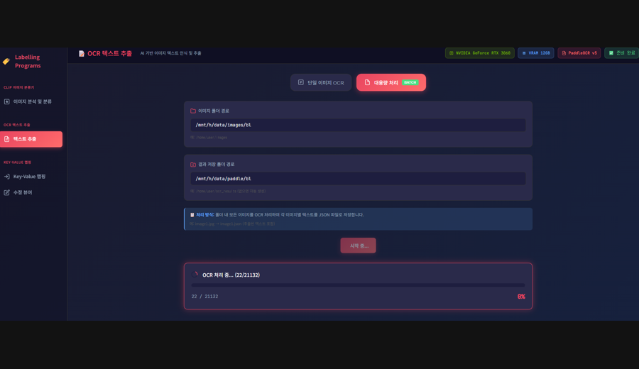

# 🏷️ Labelling Programs  

  
  
  
  
  

## 🎥 Demo Preview

  
  

> 좌: Key–Value Annotation Editor &nbsp;&nbsp;|&nbsp;&nbsp; 우: Large-Scale OCR Batch Processing

---

## 🧠 What This Project Is

**Labelling Programs**는 범용 데이터 라벨링을 위한 통합 **Annotation Platform**입니다.  

실무 환경에서 반복되는 **데이터 구조 불일치**, **툴 분산**,  
**대용량 처리 한계**를 해결하기 위해 제작되었으며,  

**분류 · OCR · 구조 해석 · Key-Value 매핑 · 배치 처리**까지  
하나의 **End-to-End 파이프라인**으로 통합했습니다.  

웹 인터페이스는 **Vibe Coding 기반 풀스택 구조**로 빠르게 구축했고,  
핵심 **분류 · 매칭 · 후처리 로직은 직접 설계한 AI 엔진**으로 구현했습니다.  

본 프로젝트는 단일 기능이 아닌, 앞으로도 지속적으로 확장되는  
**실무 중심 통합 라벨링 인프라**를 목표로 개발되고 있습니다.

---

## 🧩 Tech Snapshot

- **Vision**  
  CLIP (ViT-B/32), Custom Similarity Engine

- **OCR**  
  PaddleOCR v5

- **Backend**  
  Python 3.10+, Flask (Engine-Oriented API)

- **Frontend**  
  HTML5 · CSS3 · JavaScript  
  Canvas-based Annotation UI (Vibe Coding)

- **Infra**  
  Docker · CUDA · GPU Auto Detection

---

## 🔄 Ongoing Project

- DocLayout-YOLO 기반 **Document Layout Detection Labeling**
- **Fine-tuned Model** 선택 적용 구조
- **Multi-Model Plugin Architecture** 확장 예정

---
