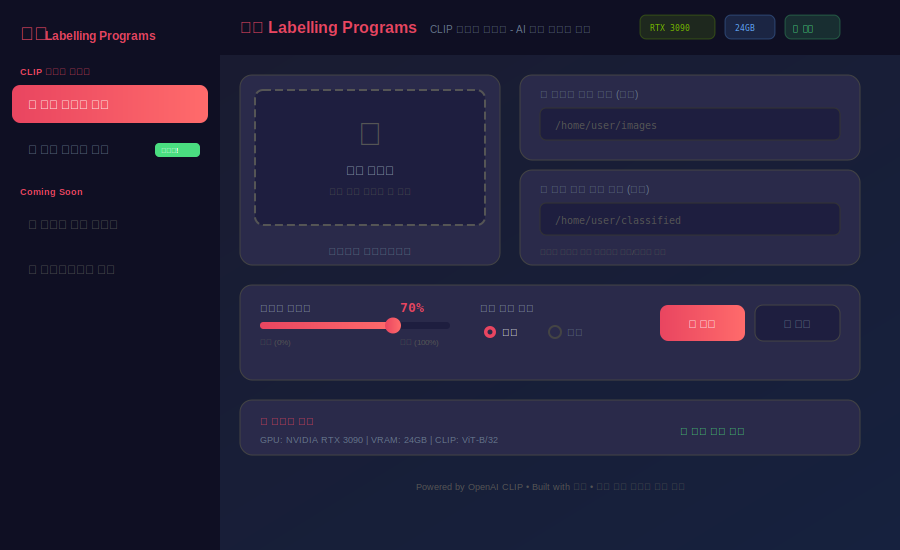
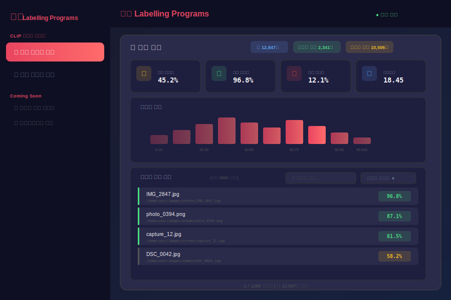
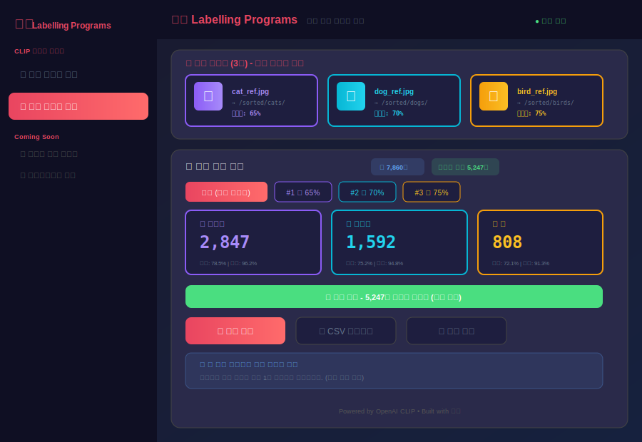

<p align="center">
  
  
  
  
  
</p>

<h1 align="center">🏷️ Labelling Programs</h1>

<p align="center">
  <b>AI 기반 이미지 라벨링 및 분류 도구 모음</b>
</p>

<p align="center">
  OpenAI CLIP 모델을 활용한 이미지 유사도 분석, 자동 분류 등<br/>
  다양한 라벨링 프로그램을 제공하는 웹 애플리케이션입니다.
</p>

<h3 align="center">현재 지원 프로그램</h3>
<p align="center">
  ✅ <b>CLIP 이미지 분류기</b> - 유사도 기반 자동 분류<br/>
  🔜 바운딩 박스 라벨러 (Coming Soon)<br/>
  🔜 세그멘테이션 도구 (Coming Soon)
</p>

---

## 🎬 데모

### 메인 화면
<p align="center">
  
</p>

### 분석 결과
<p align="center">
  
</p>

### 다중 기준 이미지 분류
<p align="center">
  
</p>

---

## ✨ 주요 기능

### 🎯 단일 기준 이미지 분석
- 하나의 기준 이미지와 폴더 내 모든 이미지의 유사도 계산
- 유사도 순위별 정렬 및 통계 제공

### 🎯 다중 기준 이미지 분석
- 여러 기준 이미지를 동시에 분석
- 각 이미지가 어떤 기준과 가장 유사한지 자동 매칭
- 기준별 개별 임계치 설정 가능

### ⚡ 고성능 배치 처리
- GPU VRAM에 따른 자동 배치 사이즈 최적화
- OOM(Out of Memory) 발생 시 자동 배치 크기 조절
- 대량 이미지(수만 장) 처리 지원

### 📁 자동 분류
- 설정한 임계치 이상의 이미지 자동 분류
- 복사/이동 모드 선택
- 다중 기준 이미지별 개별 폴더로 분류

### 📊 실시간 진행률
- 분석 진행 상황 실시간 모니터링
- 배치 처리 상태 및 예상 시간 표시

---

## 🛠️ 기술 스택

| Category | Technologies |
|----------|-------------|
| **AI/ML** | OpenAI CLIP (ViT-B/32), PyTorch |
| **Backend** | Python, Flask |
| **Frontend** | HTML5, CSS3, JavaScript |
| **Infra** | Docker, NVIDIA CUDA |

---

## 🚀 빠른 시작

### 사전 요구사항

- Docker & Docker Compose
- (선택) NVIDIA GPU + NVIDIA Container Toolkit

### 설치 및 실행

```bash
# 1. 레포지토리 클론
git clone https://github.com/seonm9119/clip-image-classifier.git
cd clip-image-classifier

# 2. Docker 이미지 빌드
./docker-start.sh build

# 3. 서버 실행 (GPU/CPU 자동 감지)
./docker-start.sh
```

### 접속

```
http://localhost:5000
```

---

## 📖 사용 방법

### Docker 명령어

```bash
# 서버 실행 (자동 GPU/CPU 감지)
./docker-start.sh

# GPU 모드 강제 실행
./docker-start.sh gpu

# CPU 모드 강제 실행
./docker-start.sh cpu

# 로그 확인
./docker-start.sh logs

# 서버 중지
./docker-start.sh stop

# 이미지 재빌드
./docker-start.sh build
```

### 이미지 폴더 마운트

`docker-compose.yml`에서 분석할 이미지 폴더를 설정:

```yaml
volumes:
  - /your/image/folder:/data/images:ro
```

컨테이너 내부에서는 `/data/images` 경로로 접근합니다.

---

## 🔌 API 엔드포인트

### 단일 기준 이미지 분석

| Method | Endpoint | Description |
|--------|----------|-------------|
| `POST` | `/analyze/start` | 분석 시작 |
| `GET` | `/analyze/progress/<task_id>` | 진행 상황 조회 |
| `POST` | `/classify` | 분류 실행 |

### 다중 기준 이미지 분석

| Method | Endpoint | Description |
|--------|----------|-------------|
| `POST` | `/multi-analyze/start` | 다중 분석 시작 |
| `GET` | `/multi-analyze/progress/<task_id>` | 진행 상황 조회 |
| `POST` | `/multi-classify` | 다중 분류 실행 |

---

## 📂 프로젝트 구조

```
clip-image-classifier/
├── app.py                 # Flask 메인 애플리케이션
├── requirements.txt       # Python 의존성
├── Dockerfile            # Docker 이미지 정의
├── docker-compose.yml    # Docker Compose 설정
├── docker-start.sh       # Docker 실행 스크립트
├── .dockerignore         # Docker 빌드 제외 파일
├── templates/
│   └── index.html        # 웹 UI
├── static/
│   ├── style.css         # 스타일시트
│   └── script.js         # 클라이언트 스크립트
└── uploads/              # 임시 업로드 폴더
```

---

## ⚙️ 시스템 요구사항

### 최소 사양
- CPU: 4코어 이상
- RAM: 8GB 이상
- 저장공간: 10GB 이상

### 권장 사양 (GPU)
- NVIDIA GPU (CUDA 12.1 지원)
- VRAM: 4GB 이상
- RAM: 16GB 이상

---

## 📈 성능

| 환경 | 이미지 처리 속도 |
|------|-----------------|
| RTX 3090 (24GB) | ~500 img/s |
| RTX 3060 (12GB) | ~300 img/s |
| CPU (i7-12700) | ~10 img/s |

*실제 성능은 이미지 크기 및 시스템 환경에 따라 다를 수 있습니다.*

---

## 🤝 기여하기

1. Fork the Project
2. Create your Feature Branch (`git checkout -b feature/AmazingFeature`)
3. Commit your Changes (`git commit -m 'Add some AmazingFeature'`)
4. Push to the Branch (`git push origin feature/AmazingFeature`)
5. Open a Pull Request

---

## 📄 라이선스

This project is licensed under the MIT License - see the [LICENSE](LICENSE) file for details.

---

## 🙏 Acknowledgments

- [OpenAI CLIP](https://github.com/openai/CLIP) - Contrastive Language-Image Pre-training
- [PyTorch](https://pytorch.org/) - Deep Learning Framework
- [Flask](https://flask.palletsprojects.com/) - Web Framework

---

<p align="center">
  Made with ❤️ by <a href="https://github.com/seonm9119">seonm9119</a>
</p>
